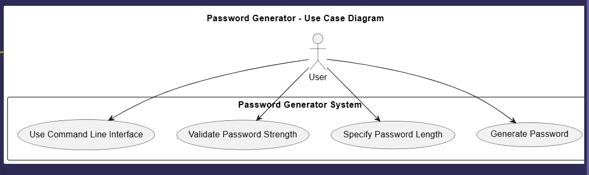
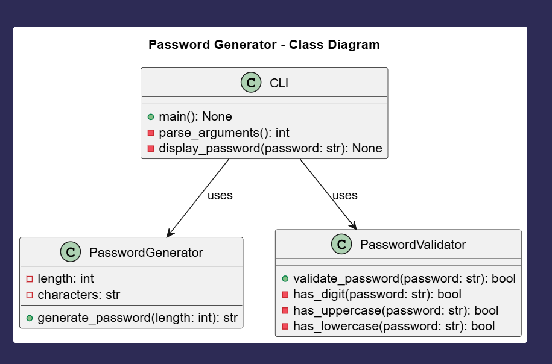
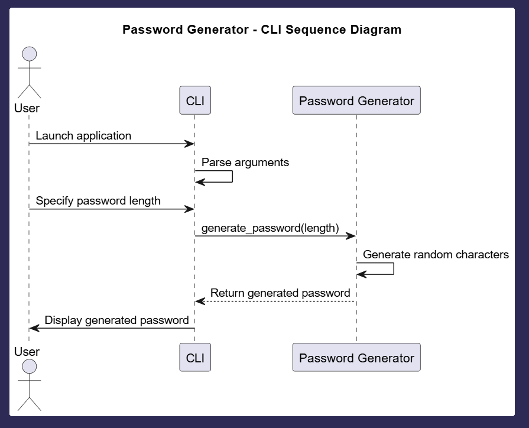

# Password Generator

A secure and customizable password generator built with Python.

This project provides a simple and maintainable tool to generate secure passwords and validate password strength.

The project follows professional software development practices:

- Clean Python architecture using `src` layout
- Automated testing with `pytest`
- Git feature branch workflow
- Pull Request based development
- DevOps-oriented project organization


## Features

## Password Generation

Generate secure random passwords with customizable options.

Supported characters:

- Uppercase letters (`A-Z`)
- Lowercase letters (`a-z`)
- Numbers (`0-9`)
- Special characters (`!@#$%^&*...`)


## Password Validation

Validate password strength according to security rules:

- Minimum password length
- At least one uppercase letter
- At least one lowercase letter
- At least one digit


## Command Line Interface (CLI)

Generate passwords directly from your terminal.

Example:

```bash
python -m password_generator.cli --length 20

## Project Structure

The project follows a standard Python `src` layout to separate application code from tests.

password-generator/
│
├── src/
│   └── password_generator/
│       ├── __init__.py
│       ├── generator.py
│       ├── validator.py
│       └── cli.py
│
├── tests/
│   ├── test_generation.py
│   ├── test_validator.py
│   └── test_cli.py
│
├── pyproject.toml
├── README.md
├── .gitignore

## (Future CI/CD integration)
.github/
└── workflows/
    └── ci.yml

## Folder Description

| Folder/File | Description |
|-------------|-------------|
| `src/password_generator/` | Main Python package |
| `generator.py` | Password generation logic |
| `validator.py` | Password strength validation |
| `cli.py` | Command line interface |
| `tests/` | Automated tests using pytest |
| `pyproject.toml` | Python project configuration |
## (To add ...)
| `.github/workflows/` | CI/CD automation |

## UML Diagrams

### Use Case Diagram



### Class Diagram



### Sequence Diagram

